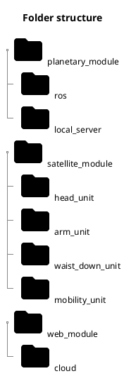

# src

```plantuml
@startuml
scale max 1024 width

title Folder structure
!include <tupadr3/devicons/python.puml>
!include <material/folder.puml>

salt
{{T
    + <$ma_folder> planetary_module
     ++ <$ma_folder> ros
     ++ <$ma_folder> local_server
    + <$ma_folder> satellite_module
     ++ <$ma_folder> head_unit
     ++ <$ma_folder> arm_unit
     ++ <$ma_folder> waist_down_unit
     ++ <$ma_folder> mobility_unit
    + <$ma_folder> web_module
     ++ <$ma_folder> cloud
  }
}

@enduml
```
