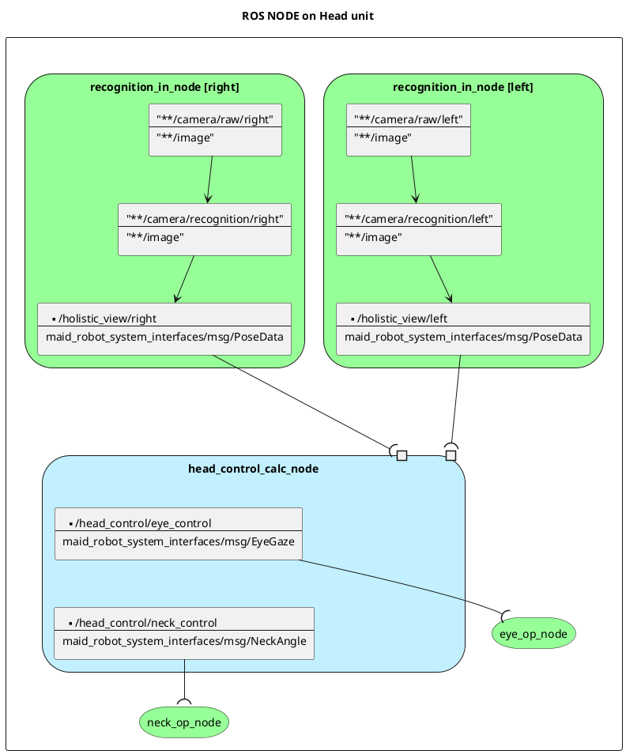
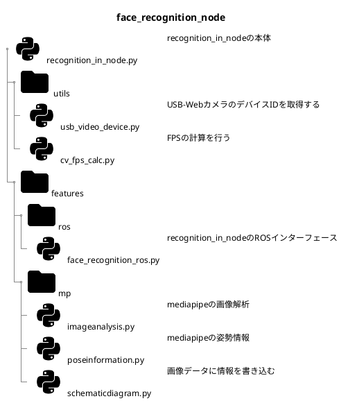

# MaidRobotSystem

## Head unit

---

### head_control_node

### neck_node

### face_recognition_node

USB-Webカメラより画像を取得し、姿勢制御情報を通達する。

### Todo

計算処理はこのノードから切り離すべき？

## ノード名規則

<機能名>_<type>_node

| type   |                                                |     |
| ------ | ---------------------------------------------- | --- |
| calc   | 入力に従って演算するノードタイプ               |     |
| op     | 受け付けた処理にしたがって動作するノードタイプ |     |
| in     | 入力装置からの処理をROSに変換するノードタイプ  |     |
| notify | 外部へ通達するノードタイプ                     |     |

