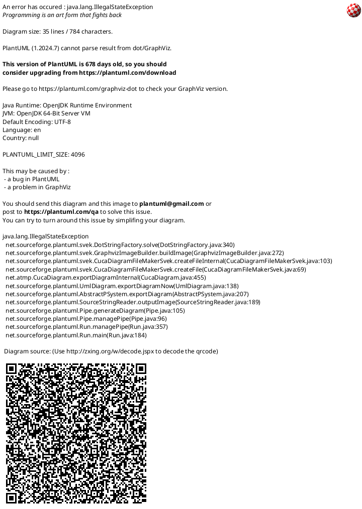

# roboclawForZLAC

これはZLAC-706を[roboclaw_ros](https://github.com/sonyccd/roboclaw_ros)で制御するためのプロジェクト。
roboclawを繋ぐかわりにM5ATOMを接続し、その先のZLAC-706を制御する。


## 開発環境

### ハード

|  No. | 種別     |                         | 個数 |
| ---: | -------- | ----------------------- | ---- |
|    1 | MPU      | MPU                     | 1    |
|    2 | MCU      | M5ATOM Lite             | 1    |
|    3 | board    | connect board(変換基板) | 1    |
|    4 | ケーブル | USBケーブル             | 1    |
|    5 | ^        | LANケーブル(ストレート) | 2    |
|    6 | Battery  | Battery(24V)            | 1    |
|    7 | Motor    | ZLAC706                 | 2    |
|    8 | ^        | Motor                   | 2    |


### ソフトウエア

* roboclawForZLAC
  * PlatformIO
  * ライブラリ
    * m5stack/M5Atom@^0.1.0
    * fastled/FastLED@^3.5.0

## 変換基板の仕様について

ZLAC-706の受け口はLANコネクタのため、UARTからLANコネクタに変換する基板を自作する必要がある。
下記にroboclawForZLACを使った場合の変換基板の配線について記載する。




## LEDの表示色について


| 色/状態  | 意味                 |
| -------- | -------------------- |
| 点滅     | WiFi未接続           |
| White    | Boot中               |
| DarkCyan | 起動中               |
| Blue     | 未設定による起動失敗 |
| Green    | 正常動作中           |
| Yellow   | 緊急停止中           |
| Red      | エラー発生           |

### WiFi接続

ファイル```lib/web/web_setting.hpp```にてWiFi接続先を設定を記載してます。
platformio.iniに下記の設定を追加することで、WiFi接続先を変更することができます。

```ini
build_flags =
    ...(other setting)
    -D SETTING_WIFI_MODE_AP=false
    -D SETTING_WIFI_SSID_DEFAULT="\"ESP32_WEB_VIEWER\""
    -D SETTING_WIFI_PASS_DEFAULT="\"password\""
```


## 仕様

* ZLAC
  * Serial(UART)
    * ボーレート : 57600
    * "**inverted**" uart signal


---

<style>
body {
    counter-reset: chapter;
}

h2 {
    counter-reset: sub-chapter;
}

h3 {
    counter-reset: section;
}

h4 {
    counter-reset: indexlist;
}

h1::before {
    counter-reset: chapter;
}

h2::before {
    counter-increment: chapter;
    content: counter(chapter) ". ";
}

h3::before {
    counter-increment: sub-chapter;
    content: counter(chapter) "-" counter(sub-chapter) ". ";
}

h4::before {
    counter-increment: section;
    content: counter(chapter) "-" counter(sub-chapter) "-" counter(section) ". ";
}

h5::before {
    counter-increment: indexlist;
    content: "(" counter(indexlist) ") ";
}

#sidebar-toc-btn {
    bottom: unset;
    top: 8px;
}

.markdown-preview.markdown-preview {
    h2 {
        border-bottom: 4px solid #eaecef;
    }

    h3 {
        border-bottom: 1px solid #eaecef;
    }
}

.md-sidebar-toc.md-sidebar-toc {
    padding-top: 40px;
}

#sidebar-toc-btn {
    bottom: unset;
    top: 8px;
}
</style>
