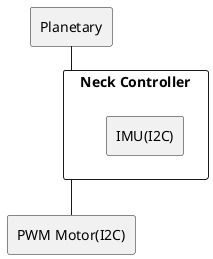

# Neck Controller

Modbus on Serialで通信して制御するためのデバイス。
Modbusのアドレスは下記を参照のこと。

* サポートしている機能
  * IMU(6軸)
  * PWM Servo Motor(３つ)

## Modbus data

|             |                         |     |
| ----------- | ----------------------- | --- |
| Address     |                         | --  |
| Function    |                         | --  |
| Data-length |                         | --  |
| Data        | Num(H)                  | --  |
| ^           | Num(L)                  | --  |
| ^           | Num x (Data-length x 2) | --  |
| Error check |                         | --  |

### レジスタ

| Num    | Device type | --      | Note |
| ------ | ----------- | ------- | ---- |
| 0x6810 | IMU         | accel.x | --   |
| 0x6811 | IMU         | accel.y | --   |
| 0x6812 | IMU         | accel.z | --   |
| 0x6813 | IMU         | gyro.x  | --   |
| 0x6814 | IMU         | gyro.y  | --   |
| 0x6815 | IMU         | gyro.z  | --   |

| Num    | Device type              | --                      | Note |
| ------ | ------------------------ | ----------------------- | ---- |
| 0x7000 | PWM Motor(I2C) - Setting | Oscillator Frequency(H) |      |
| 0x7001 | PWM Motor(I2C) - Setting | Oscillator Frequency(L) |      |
| 0x7002 | PWM Motor(I2C) - Setting | PWM Frequency(H)        |      |
| 0x7003 | PWM Motor(I2C) - Setting | PWM Frequency(L)        |      |

| Num    | Device type            | --  | Note          |
| ------ | ---------------------- | --- | ------------- |
| 0x7100 | PWM Motor(I2C) - ALL   | --  | for Broadcast |
| 0x7101 | PWM Motor(I2C) - No.01 | --  |               |
| 0x7102 | PWM Motor(I2C) - No.02 | --  |               |
| 0x7103 | PWM Motor(I2C) - No.03 | --  |               |
| ...    |                        |     |               |

| Num    | Device type            | --  | Note |
| ------ | ---------------------- | --- | ---- |
| 0x3101 | PWM Motor(I2C) - No.01 | --  |      |
| 0x3102 | PWM Motor(I2C) - No.02 | --  |      |
| 0x3103 | PWM Motor(I2C) - No.03 | --  |      |
| ...    |                        |     |      |

