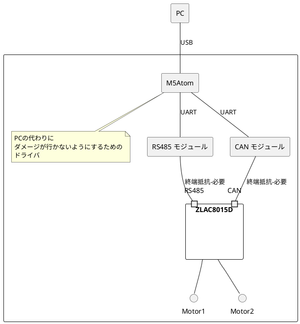

## 設計思想

PC側で動いているプログラムは統括的な制御を行うことに集中して欲しく、
モータードライバの制御はプロトコルレベルまで抽象化して、PC側のプログラムが気にすることが少ないようにする。

モータードライバの制御がシリアルだったりCANだったりインターフェイスが異なるための、USB（シリアル）で接続されたM5Atomというデバイスを介する設計とする。

このことにより、PC側はUSB(シリアル)とプロトコルのみを、
M5Atom側は上記プロトコルを受け取ってモータードライバの制御を行うことに集中できるようにして、双方のに影響を与えないようにする。

