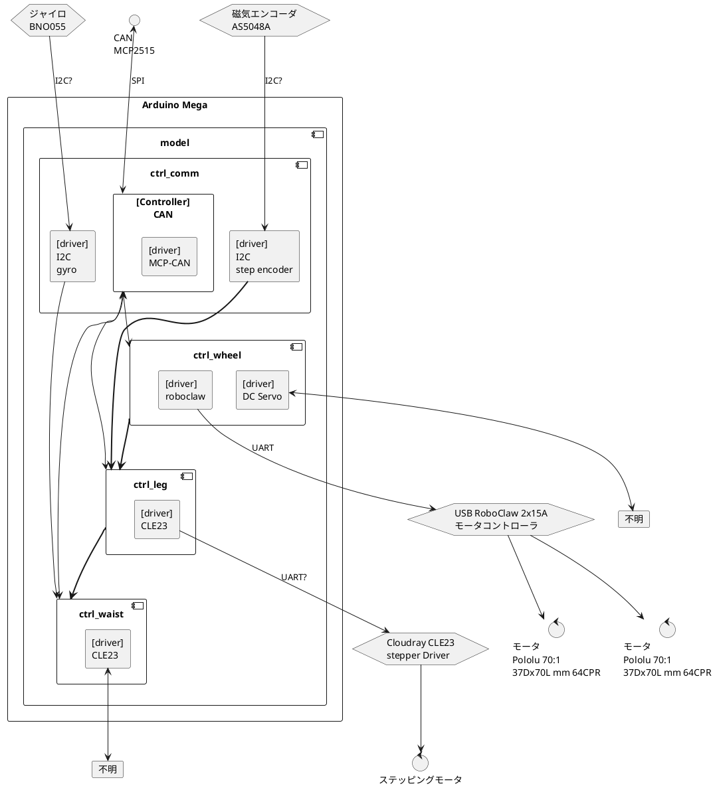

## Wiring

## Left Pin connecter

|  No.  | Name  | FNC | Analog/Digital | 接続機器       | DEFINE                  |
| :---: | ----- | --- | :------------: | -------------- | ----------------------- |
| (l-a) | NC    |     |                |                |                         |
| (l-b) | IOREF |     |                |                |                         |
| (l-c) | RESET |     |                |                |                         |
| (l-d) | +3V3  |     |                |                |                         |
| (l-e) | +5V   |     |                |                |                         |
| (l-f) | GND   |     |                |                |                         |
| (l-g) | GND   |     |                |                |                         |
| (l-h) | VIN   |     |                |                |                         |
|  --   |       |     |                |                |                         |
|  54   | PF0   | A0  |                |                |                         |
|  55   | PF1   | A1  |                |                |                         |
|  56   | PF2   | A2  |    アナログ    | 磁気エンコーダ | PIN_LEG_POSITION        |
|  57   | PF3   | A3  |                |                | PIN_STEPPER_SERVO_ERROR |
|  58   | PF4   | A4  |                |                |                         |
|  59   | PF5   | A5  |                |                |                         |
|  60   | PF6   | A6  |                |                |                         |
|  61   | PF7   | A7  |                |                |                         |
|  --   |       |     |                |                |                         |
|  62   | PK0   | A8  |                |                |                         |
|  63   | PK1   | A9  |                |                |                         |
|  64   | PK2   | A10 |                |                |                         |
|  65   | PK3   | A11 |                |                |                         |
|  66   | PK4   | A12 |                |                |                         |
|  67   | PK5   | A13 |                |                |                         |
|  68   | PK6   | A14 |                |                |                         |
|  69   | PK7   | A15 |                |                |                         |

## Right Pin connecter

|  No.  | Name | FNC | Analog/Digital | 接続機器  | DEFINE                        |
| :---: | ---- | --- | :------------: | --------- | ----------------------------- |
|  20   | PD0  | SCL |                |           |                               |
|  21   | PD1  | SDA |                |           |                               |
| (r-a) | AREF |     |                |           |                               |
| (r-b) | GND  |     |                |           |                               |
|  13   | PB7  |     |                | ボードLED | PIN_BOARD_LED                 |
|  12   | PB6  |     |                |           |                               |
|  11   | PB5  |     |                |           |                               |
|  10   | PB4  |     |                |           |                               |
|   9   | PH6  |     |                |           |                               |
|   8   | PH5  |     |                |           |                               |
|   7   | PH4  |     |                |           | PIN_LEG_PWM_LEFT              |
|   6   | PH3  |     |                |           | PIN_LEG_PWM_RIGHT             |
|   5   | PE3  |     |                |           |                               |
|   4   | PG5  |     |                |           |                               |
|   3   | PE5  |     |                |           |                               |
|   2   | PE4  |     |                |           | PIN_COMMUTATION_CAN_INTERRUPT |
|   1   | PE1  | TX0 |                | Debug用   | (ライブラリで指定)            |
|   0   | PE0  | RX0 |                | Debug用   | (ライブラリで指定)            |
|  --   |      |     |                |           |                               |
|  14   | PJ1  | TX3 |                |           |                               |
|  15   | PJ0  | RX3 |                |           |                               |
|  16   | PH1  | TX2 |                |           |                               |
|  17   | PH0  | RX2 |                |           |                               |
|  18   | PD3  | TX1 |                | RoboClaw  | (ライブラリで指定)            |
|  19   | PD2  | RX1 |                | RoboClaw  | (ライブラリで指定)            |
|  20   | PD1  | SDA |                |           | (ライブラリで指定)            |
|  21   | PD0  | SCL |                |           | (ライブラリで指定)            |

## Bottom Pin connecter

|  No.  | Name | FNC       | Analog/Digital | 接続機器       | DEFINE                           |
| :---: | ---- | --------- | :------------: | -------------- | -------------------------------- |
| (b-a) | +5V  |           |                |                |                                  |
| (b-b) | +5V  |           |                |                |                                  |
|  22   | PA0  | AD0       |                |                |                                  |
|  23   | PA1  | AD1       |                |                |                                  |
|  24   | PA2  | AD2       |                |                |                                  |
|  25   | PA3  | AD3       |                |                |                                  |
|  26   | PA4  | AD4       |                |                |                                  |
|  27   | PA5  | AD5       |                |                |                                  |
|  28   | PA6  | AD6       |                |                |                                  |
|  29   | PA7  | AD7       |                |                |                                  |
|  30   | PC7  | A15       |                |                |                                  |
|  31   | PC6  | A14       |                |                |                                  |
|  32   | PC5  | A13       |                |                |                                  |
|  33   | PC4  | A12       |                |                |                                  |
|  34   | PC3  | A11       |                |                | PIN_STEPPER_SERVO_PLUS           |
|  35   | PC2  | A10       |                |                | PIN_STEPPER_SERVO_DIR            |
|  36   | PC1  | A9        |                |                | PIN_STEPPER_SERVO_ENABLE         |
|  37   | PC0  | A8        |                |                |                                  |
|  38   | PC7  | T0        |                |                | PIN_WHEEL_ENABLE                 |
|  39   | PG2  | ALE       |                |                |                                  |
|  40   | PG1  | RD        |                |                |                                  |
|  41   | PG0  | WR        |                |                |                                  |
|  42   | PL7  |           |                |                |                                  |
|  43   | PL6  |           |                |                |                                  |
|  44   | PL5  |           |                |                | PIN_WAIST_PITCH                  |
|  45   | PL4  |           |                |                |                                  |
|  46   | PL3  |           |                |                |                                  |
|  47   | PL2  |           |                |                |                                  |
|  48   | PL1  |           |                |                |                                  |
|  49   | PL0  |           |                |                |                                  |
|  50   | PB3  | CIPO/MISO |      SPI       | CAN MCP2515 | (ライブラリで指定)               |
|  51   | PB2  | COPI/MOSI |       ^        | ^              | (ライブラリで指定)               |
|  52   | PB1  | SCK       |       ^        | ^              | (ライブラリで指定)               |
|  53   | PB0  | N_SS      |       ^        | ^              | PIN_COMMUTATION_CAN_CHIP_CONTROL |
| (b-c) | GND  |           |                |                |                                  |
| (b-d) | GND  |           |                |                |                                  |
